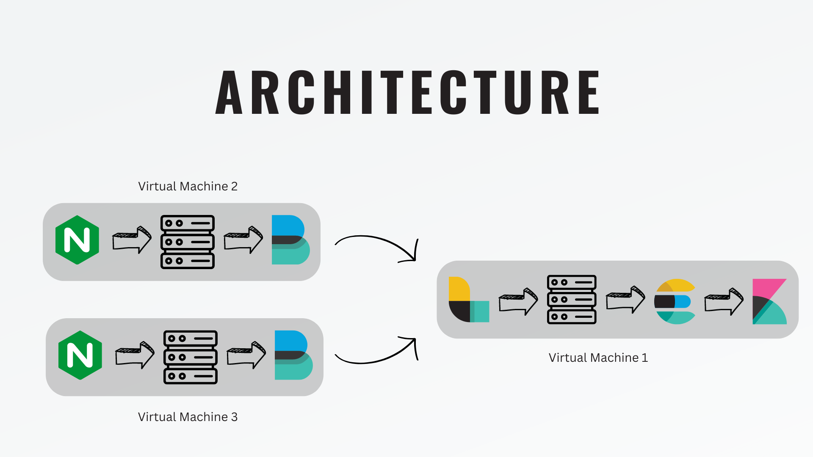
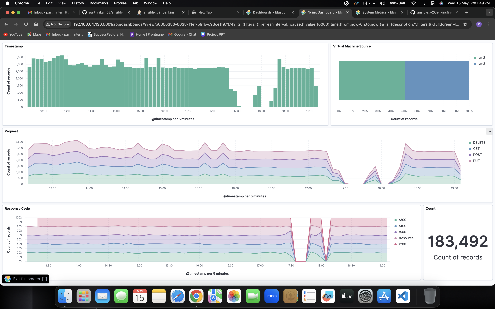
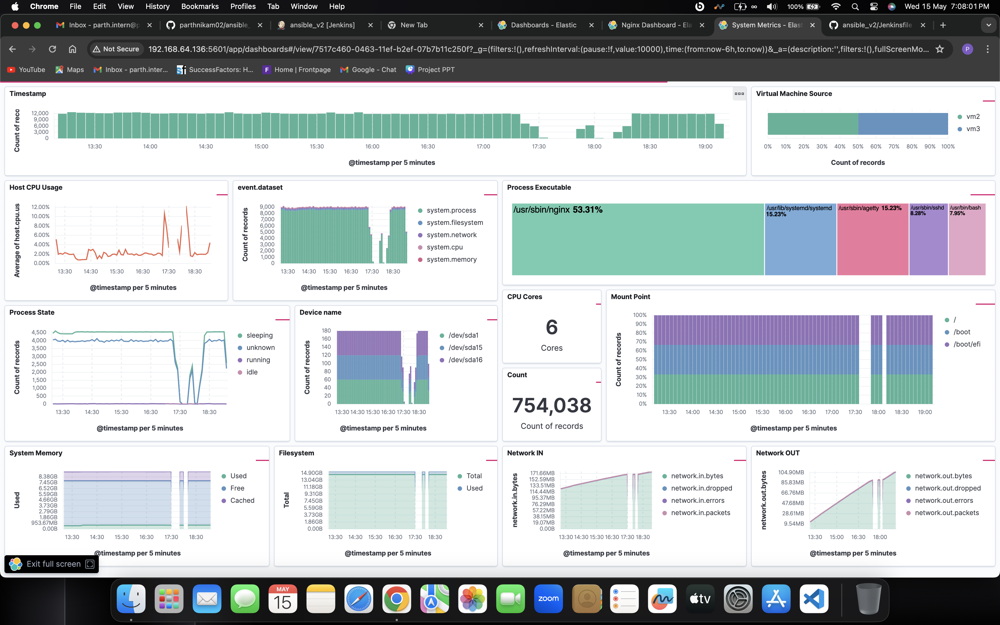

# Nginx and System Logs Dashboard

## Project Overview

This project sets up a comprehensive log collection and monitoring platform using the ELK Stack (Elasticsearch, Logstash, Kibana), Filebeat, and Metricbeat. It includes automated deployment and CI/CD pipelines managed by Ansible and Jenkins.

## Data Flow

1. Logs are generated on VMs by Nginx and system services.
2. Filebeat and Metricbeat collect and forward logs to Logstash.
3. Logstash processes the logs and sends them to Elasticsearch for storage and retrieval.
4. Kibana connects to Elasticsearch to fetch log data and presents it in dashboards.

## Architecture

## Nginx Dashboard

## System Dashboard

## Demo Video

[Watch the Jenkins Pipeline Demo](assets/Dashboard_Jenkins.mp4)

## Deployment

To deploy the project, follow these steps:

1. **Configure Jenkins Pipeline**
   - Add the `Jenkinsfile` to your Jenkins project.
   - Ensure Jenkins has the necessary permissions and plugins to run the pipeline.

2. **Run the Jenkins Pipeline**
   - Trigger a build in Jenkins to start the deployment process.
   - Jenkins will execute the Ansible playbook (`playbook.yml`) defined in the project.

## Project Repository

For detailed project structure and files, visit the [GitHub repository](https://github.com/parth-nikam/nginx_system_dashboard).

